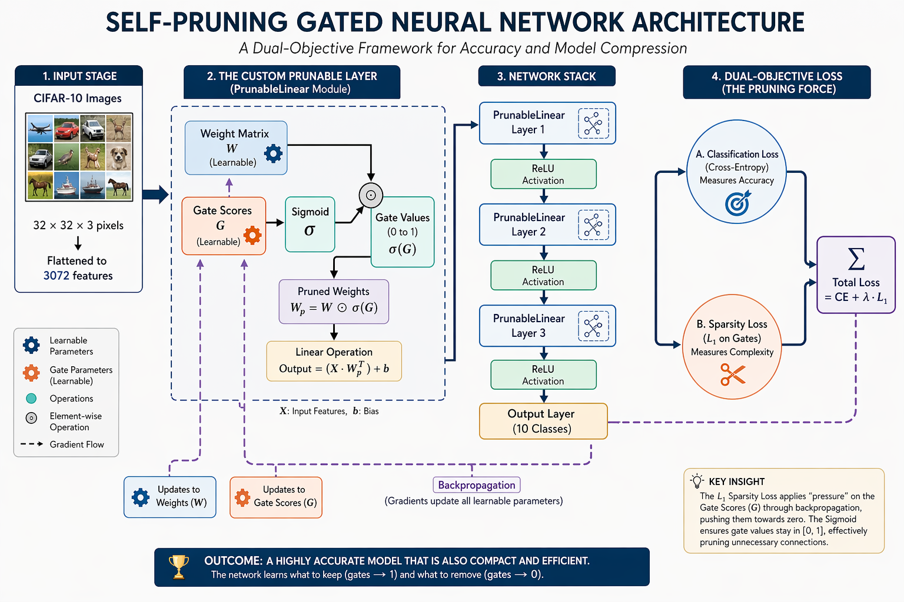

# AI Agent Pruning Engine: Self-Pruning Neural Network  
### A Dual-Objective Framework for Model Compression and Accuracy Optimization  

---

## Project Overview  

This repository implements a **Self-Pruning Neural Network** designed to autonomously optimize its architecture during the training phase.  

By integrating a **learnable gating mechanism** directly into the linear layers, the model identifies and prunes redundant connections, achieving high levels of sparsity while maintaining competitive classification accuracy on the **CIFAR-10 dataset**.  

This project demonstrates a **"Builder Mindset" in AI Engineering**, focusing on the trade-off between **computational efficiency** and **model performance**.  

---

## System Architecture  

The engine replaces standard linear layers with a custom **`PrunableLinear`** module. Each weight is governed by a learnable sigmoid gate that is "taxed" via an $L_1$ penalty, forcing the network to justify every active connection.  



---
## ⚙️ Technical Core: The Pruning Logic  

The forward pass of each layer is defined as:

y = x · (W ⊙ σ(G))^T + b

Where:
- W → Learnable weight matrix  
- G → Learnable gate scores  
- σ (Sigmoid) → Ensures gate values stay in [0, 1]  
- ⊙ (Hadamard Product) → Element-wise multiplication  

---

## Key Features  

### Dynamic Weight Pruning  
No post-training fine-tuning required; pruning happens during training.  

### Dual-Objective Loss  
Balances classification error (Cross-Entropy) with architectural complexity:

TotalLoss = CE + λ · L1

### High-Performance Training  
Optimized with GPU acceleration, multi-worker data loading, and pinned memory.  

### Custom PyTorch Implementation  
Built from scratch using core PyTorch modules (no high-level pruning wrappers).  

---

## Experimental Results  

The model was evaluated across different values of the sparsity hyperparameter (λ).

| Sparsity Penalty (λ) | Test Accuracy (%) | Sparsity Level (%) | Result |
|---------------------|------------------|--------------------|--------|
| 0.001 (Light)        | 56.33%         | 64.47%           | Highly Efficient |
| 0.01 (Balanced)      | 54.18%         | 97.33%          | Extremely Sparse |
| 0.1 (Aggressive)        | 50.82%         | 99.84%           | Minimalist Model |

---

## Gate Value Distribution  

The Gate Value Distribution plot reveals a bimodal distribution with a massive concentration at $0.0$. This indicates that the gating mechanism has successfully identified and 'switched off' non-contributing synaptic weights, effectively reducing the model's memory footprint by over $99\%$ without a catastrophic loss in classification performance. 


---

## Installation & Usage  

### 1. Clone the Repository  
```bash
git clone https://github.com/gagan1sai2/ai-agent-pruning-engine.git  
cd ai-agent-pruning-engine  
```

### 2. Environment Setup  
```bash
pip install -r requirements.txt  
```

### 3. Run the Engine  

Train the model and generate sparsity analysis:  
```bash
python main.py  
```
---

## Reasoning & Design Decisions  

### Why Sigmoid Gates?  
Sigmoid keeps gate values bounded between 0 and 1, enabling smooth gradient flow while allowing the L1 penalty to push values toward zero.  

### Why L1 Regularization?  
Unlike L2 (which shrinks weights), L1 encourages true sparsity by driving parameters exactly to zero.  

### Why CIFAR-10?  
Chosen as a benchmark dataset to validate the model’s ability to learn complex spatial patterns under sparsity constraints.  

---

## Author  

Ch Gagan Sai  
Integrated M.Tech Software Engineering student at VIT Vellore  

---
